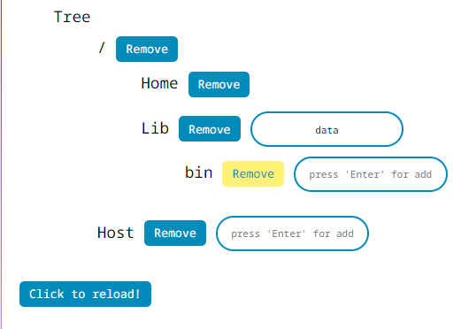

## Sample React Tree App
---

## Screenshot

## 

---

## Project setup

---

|     Comand     |              |
| :-------------: | :----------: |
|  `npm install`  | Installation |
| `npm run start` |     Run      |

## Technologies

---

| React.js |  A JavaScript library for building user interfaces   |
| :------: | :--------------------------------------------------: |
|   CSS    | Language for describing the appearance of a document |

​                         

